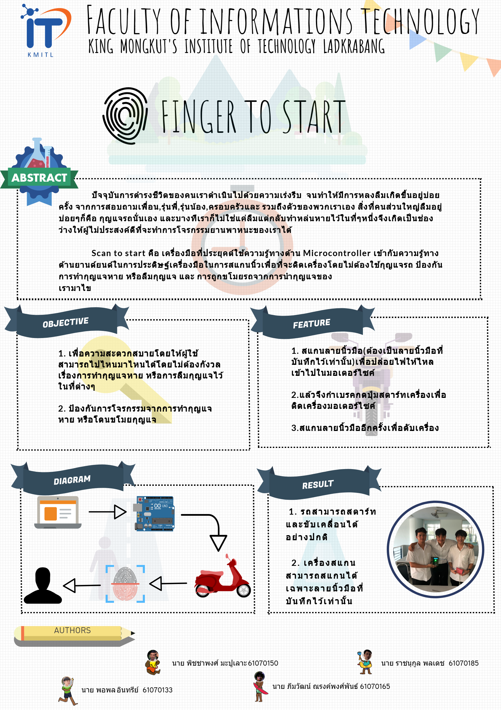
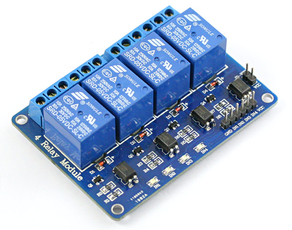
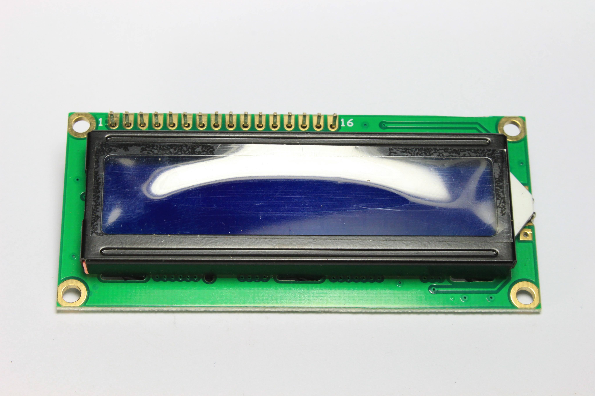
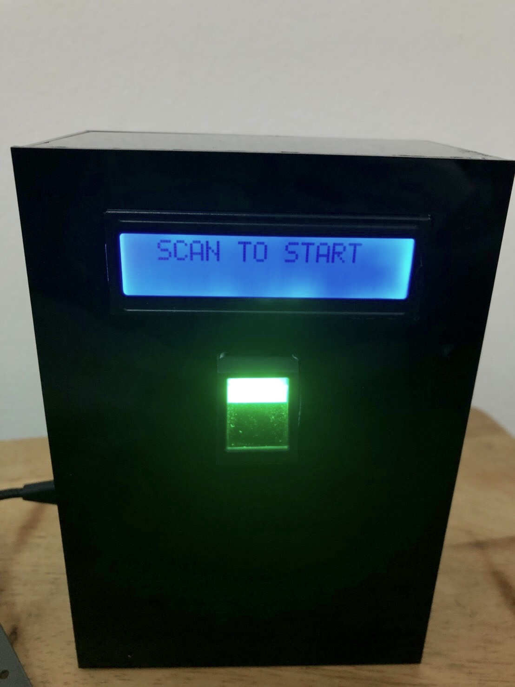
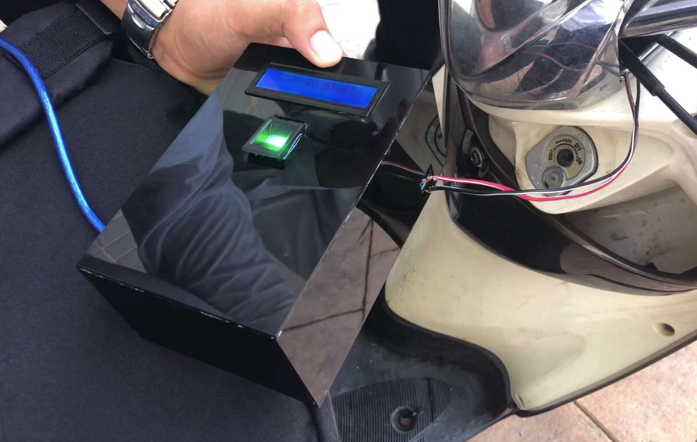

# Fingerprint To Start
    ปัจจุบันการดำรงชีวิตของคนเราดำเนินไปด้วยความเร่งรีบ จนทำให้มีการหลงลืมเกิขึ้นอยู่เสมอ 
    สิ่งหนึ่งในนั้นคือกุญแจรถนั้นเอง และบางทีเราก็ไม่ใช่แค่ลืมแต่กลับทำหล่นหายไว้ในที่ๆหนึ่งจึงเกิดเป็นช่องทางสำหรับผู้ไม่ประสงค์ดีที่จะทำการโจรกรรมยานพาหนะของเราได้
     
    Scan to start คือเครื่องมือที่ประยุกต์ใช้ความรู้ทางด้าน Microcontroller เข้ากับความรู้ทางด้านยานยนต์ในการปนะดิษฐ์เครื่องมือในการแสกนนิ้วเพื่อที่จะติดเครื่องโดยไม่ต้องใช้กุญแจรถ 
    ป้องกันการทำกุญแจหาย หรือลืมกุญแจ และการโจรกรรม

* ## จุดประสงค์
    * เพื่อความสะดวกสบายดดยให้ผู้ใช้สามารถไปไหนมาไหนได้โดยไม่ต้องกังวลเรื่องการทำกุญแจหาย หรือลืมกุญแจไว้ในที่ต่างๆ
    * ป้องกันการโจรกรรมรถยนต์ในกรณีที่โดนขโมยกุญแจ หรือกุญแจสูญหาย
* ## อุปกรณ์
    1.ESP8266 NodeMCU

    

    2.Relay 5V

    

    3.Fingerprint

    

    4.LCD

    
    
* ## วิธีการใช้
    * แสกนลายนั้วมือ(ต้องเป็นลายนิ้วมือที่บันทึกแล้วเท่านั้น)
    * แล้วจึงกำเบรคกดปุ่มสตาร์ทเพื่อติดเครื่องยนต์
    * แสกนลายนิ้วมืออีกครั้งเพื่อดับเครื่องยนต์
* ## สมาชิก
    * นาย พอพล อินทรีย์ 61070133
    * นาย ภีมวัฒน์ ณรงค์พงพันธ์ 61070165
    * นาย ราชนุกูล พลเดช 61070185
    * นาย พิชชาพงศ์ มะปูเลาะ 61070150
* ## ชิ้นงาน
    
    
